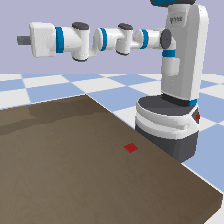

# R3-IM

#### Goal: Zero-shot imitation of human actions. 

R3M has been shown to improve learning efficiency when applied to a type of imitation learning called behavior cloning, as it is able to pull key information for robot manipulation tasks from images. A Goal-Conditioned Skill Policy (GSP) allows a robot to learn a policy that maps two states (images of the environment showing the current state and the goal state) to a sequence of actions between them. By encoding the images (state and goal/sub-goal) with a pre-trained R3M model (as opposed to an AlexNet), we expect to learn a more robust GSP with a smaller amount of training data. Our ultimate goal is to extend this to using human images as goals.

#### Behavior Cloning with pybullet and Fetch

We also extend R3M's behavior cloning expereiments by collecting training data and evaluating with the pybullet simulator and Fetch robot. Our chosen task is to pick up a small block from a table.

GSP Diagram:

References:
1) R3M: https://arxiv.org/pdf/2203.12601.pdf
2) GSP: https://pathak22.github.io/zeroshot-imitation/resources/iclr18.pdf
